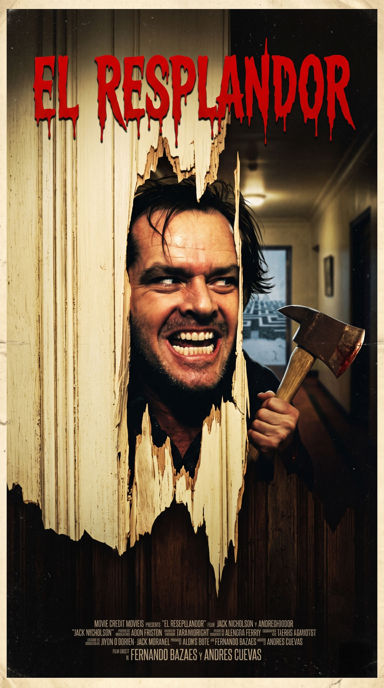
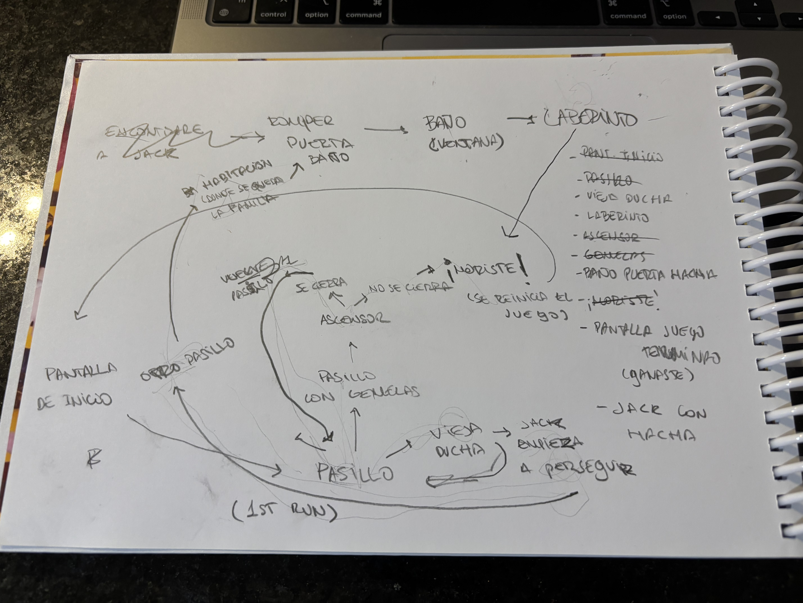

# Clase 10

## Link de web pública (github pages)

<https://drescuebbas.github.io/proyecto-pensamiento-computacional-s5/>

### Título del proyecto

Overlook

### Referencia de origen / bibliografía

The Shinning, Stanley Kubrick 1980

### Imagen de referencia de proyecto


<!-- Deja acá una imagen de la "portada" de tu proyecto. Como si fuera un afiche. Puede ser un fotograma de toda la interacción. -->

### Integrantes

Andres Cuevas[drescuebbas](https://github.com/drescuebbas)

Fernando Bazaes[fernandobzs](https://github.com/fernandobzs)


### Enlace de p5.js 

<https://editor.p5js.org>

### Relato inicial
Danny atrapado entre su don psíquicoy su violento entorno familiar, se ve jugando en un pasillo donde tiene que tomar multiples decisiones, entre alucinaciones maleficas y escapatorias para poder salir del hotel overlook donde se está consumiendo su "resplandor". 

### Storyboard

Imágenes del storyboard, las que deben verse acá y estar subidas en el mismo repositorio




### Estados

Describe acá los estados de tu máquina (mínimo 3 para proyectos individuales, 6 para parejas, 9 para tríos), y la condición de salida. Incluye la sección de código que muestra ese estado

#### Estado 1

En el primer estado, con alicia frente al conejo

al hacer scroll, Alicia empieza a caer

```js
//alicia cae
function aliciaEstatica(){
  //tu alicia quieta acá
  if (scroll) {
    caer();
  }
}
```


#### Estado 2
En este estado, el usuario ve la puerta de la habitación y debe hacer clics rápidos. Cada clic agita la pantalla y suma un punto a la variable golpesHacha.
La condición de salida es lograr 6 golpes (clics). Al llegar a ese número, el estado cambia automáticamente para iniciar la persecución final.

// Lógica de transición del Hacha
function dibujarActo4_Hacha() {
  // ... (dibuja la puerta rompiéndose en fases) ...
  
  // cndición de salida: al 6to golpe, corres de Jack
  if (golpesHacha >= 6) {
    estadoGlobal = 6; // Pasa al Laberinto
    golpesHacha = 0; // Reinicia el contador de golpes
  }
}
```

